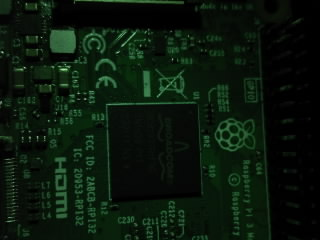

# ArduCAM STM32 HAL example  
Example of image capture and transfer with Arducam SPI camera modules connected to STM32 Nucleo L432KC.  

Camera SPI is connected to SPI1, I2C to I2C1. Data are exported via UART2 which is passed via STlink to computer as USB ACM device. As chip select is used pin PB0. Internal MCU pull-up resistors must be enabled for I2C communication lines.  

For default configuration a strong light source is required in order to not have only black image pixels.  

Compatible cameras:  
- OV2640 - Arducam mini 2Mpx  
- OV5642 - Arducam mini 5Mpx  

## Usage  
- Power up Nucleo from stable power supply (high-power capable USB)  
- Reroute serial line into file `(stty raw; cat > received.jpeg) < /dev/ttyACM0`  
    - Possibly replace interface name with correct one  
- Wait for image capture (until greed LED turns off)  
- Open image or edit it in `okteta` or other hex editor  

Sometimes serial line must be opened in some viewer (ex. picocom, screen) before rerouting. Otherwise sometimes, only some part of data is received into file.  

## Image received
Photo of RaspberryPi acquired by Arducam mini 5Mpx (OV5642) camera module (JPEG 320x240).  

